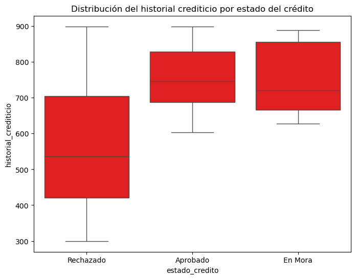
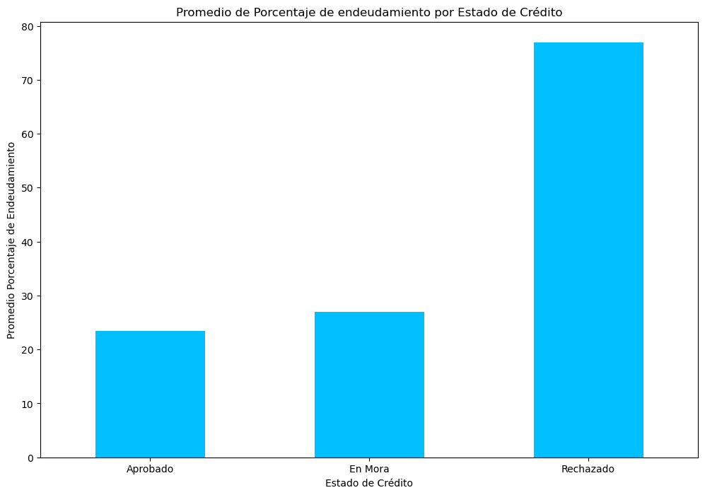
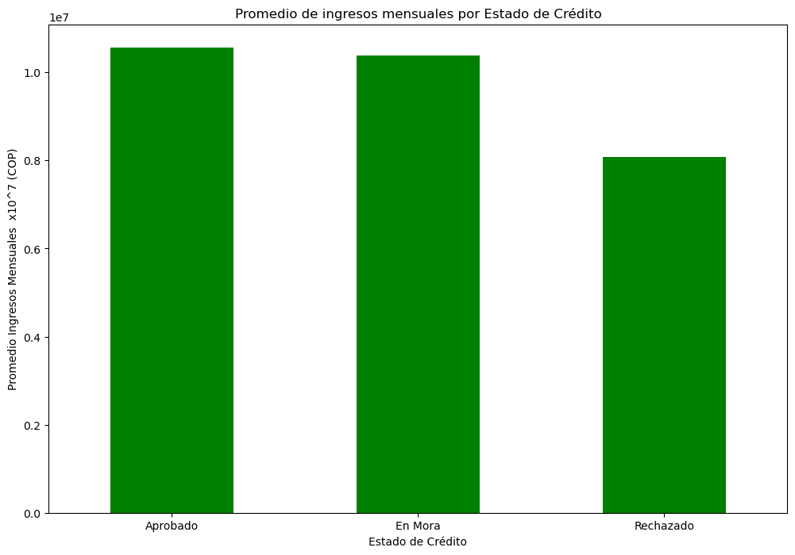

 # 📊 Análisis de Riesgo Crediticio Hipotecario en Bancos Colombianos

## 🎯 Objetivo del Proyecto  
El objetivo de este proyecto es analizar las características de los clientes para identificar qué factores están relacionados con el incumplimiento de pagos en créditos.  

## 📌 Descripción  
Para comprender mejor el riesgo crediticio, se analizaron variables clave como:  
- **Edad** en años 
- **Ingresos mensuales**  en Pesos Colombianos
- **Monto del crédito**  en Pesos Colombianos
- **Tasa de interés**  % Efectivo anual
- **Historial crediticio**  Puntaje de 0 - 1000
- **Porcentaje de endeudamiento**  %

A través de gráficos y análisis exploratorio de datos, se identificaron patrones que pueden ayudar a predecir el incumplimiento de pagos.  

---  

## 📊 Análisis Realizado  
Se utilizaron las siguientes técnicas para explorar los datos:  

1. **Histogramas** para visualizar la distribución de las variables numéricas.  
2. **Cálculo de promedios** para comparar los valores según el estado del crédito (aprobado, rechazado, en mora).  
3. **Diagramas de caja (boxplots)** para detectar valores atípicos y analizar cómo varían las variables según el estado del crédito.  

### 🛠️ Graficas  

<details>
  <summary>📊 Ver algunos gráficos</summary>

  | 📊 Gráfica | 📌 Descripción |
  |-----------|--------------|
  |  | **Historial Crediticio**: Muestra la variabilidad del historial crediticio según el estado del crédito. |
  |  | **Porcentaje de endeudamiento**: Analiza cómo el porcentaje de endeudamiento influye en la aprobación del crédito. |
  |  | **Ingresos Mensuales**: Analiza la relación entre ingresos y el estado del crédito. |

</details>

--- 

## 🔍 **Principales Hallazgos**  
- **El porcentaje de endeudamiento es un factor clave**: Los clientes con mayor endeudamiento tienen más probabilidades de estar en mora o ser rechazados.
- Los clientes con **historial crediticio más bajo** tienen mayor probabilidad de rechazo del crédito. confirmando que los bancos rechazan mas a clientes con historial crediticio deficiente 
- **Los ingresos mensuales influyen en la aprobación del crédito**, pero no de manera determinante. Los clientes con ingresos más bajos tienden a presentar más rechazos o dificultades en el pago.
- La **edad no parece ser un factor diferenciador fuerte** entre los diferentes estados del crédito en este set de datos, seria interesante detallar mas esta variable con una cantidad mayor de clientes.
  

## 🛠️ **Recomendaciones y Siguientes Pasos**

🔹 Este análisis proporciona una base para mejorar la toma de decisiones en la aprobación de créditos. Como siguiente paso, podría desarrollarse un modelo de Machine Learning que prediga la probabilidad de incumplimiento de pago basado en las variables analizadas.

🔹 Se podría también profundizar en el análisis incluyendo otras variables, realizando correlaciones y probando diferentes métodos de segmentación de clientes.

---  

## 📚 **Estructura del Proyecto**  
```
📁 proyecto-riesgo-crediticio
│── 📄 README.md  → Explicación del proyecto
│── 📄 notebook.ipynb  → Código del análisis en Python
│── 📁 imagenes  → Gráficos y visualizaciones
```

---  

## 🚀 **Cómo Ver el Análisis Completo**  
Puedes ver el código y análisis completo en el [Notebook en GitHub](https://github.com/digel1010/digel1010-riesgo_crediticio_colombia/blob/main/credito.ipynb).  

---  

## 🛠️ **Tecnologías Utilizadas**  
- **Python**  
- **Pandas**  
- **Matplotlib & Seaborn**  
- **Jupyter Notebook**  

---  

## 📩 Contacto  
Si tienes alguna pregunta sobre este proyecto, puedes escribirme en [LinkedIn](https://www.linkedin.com/in/dgelvez10/) 🚀.

